## How To Run ?

* Download Xampp Server
* Keep this project in htdocs folder present inside your Xampp directory 
* Start Apache and SQL uisng Xampp control panel 
* Click on Admin button beside SQL, after clicking phpmyadmin opens
* Create SQL databse using name users and two tables named users and data_student
* Go to Your browser and write localhost/file_name (name you gave to this file after downoading in your local computer)

## CREATE USER PAGE:

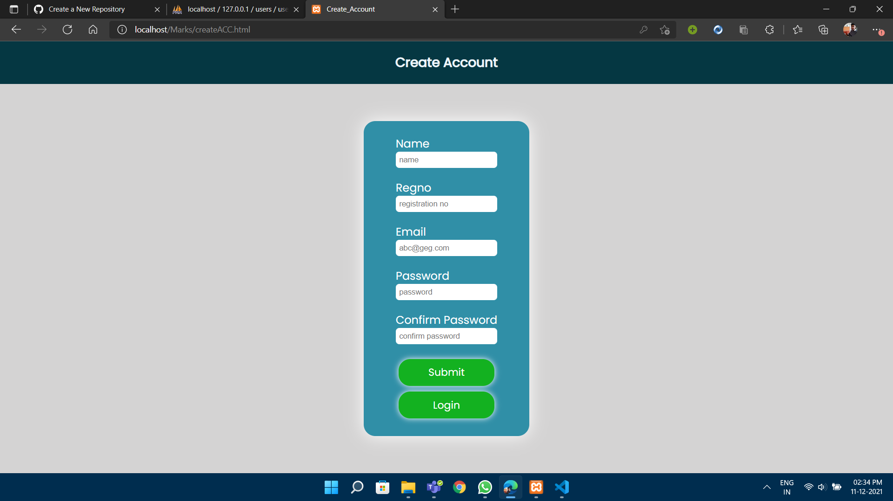

## LOGIN:

## DATABSE OF NEW USER

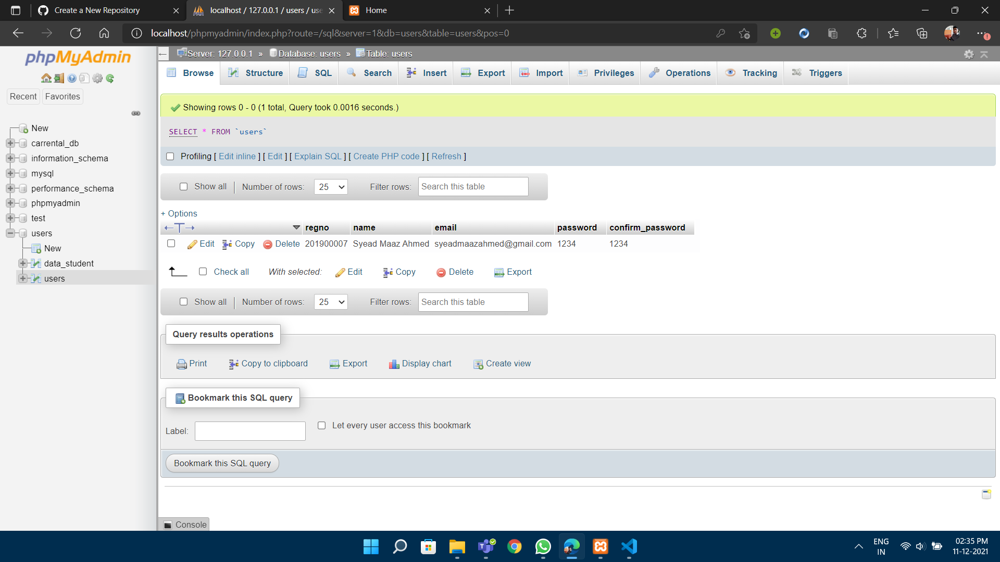

## Home page

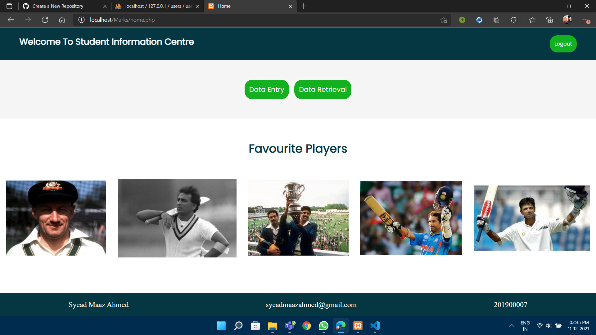

## Data Entry page

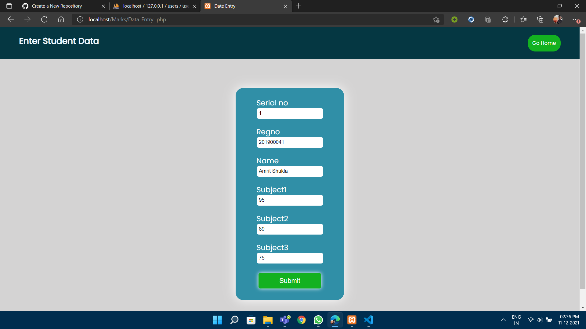

## After adding data

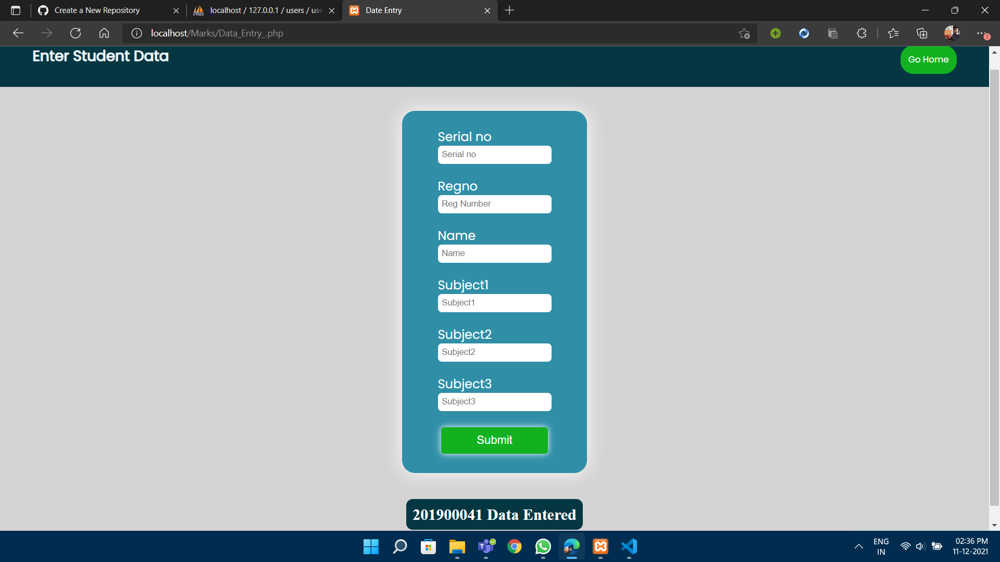

## Database after adding data

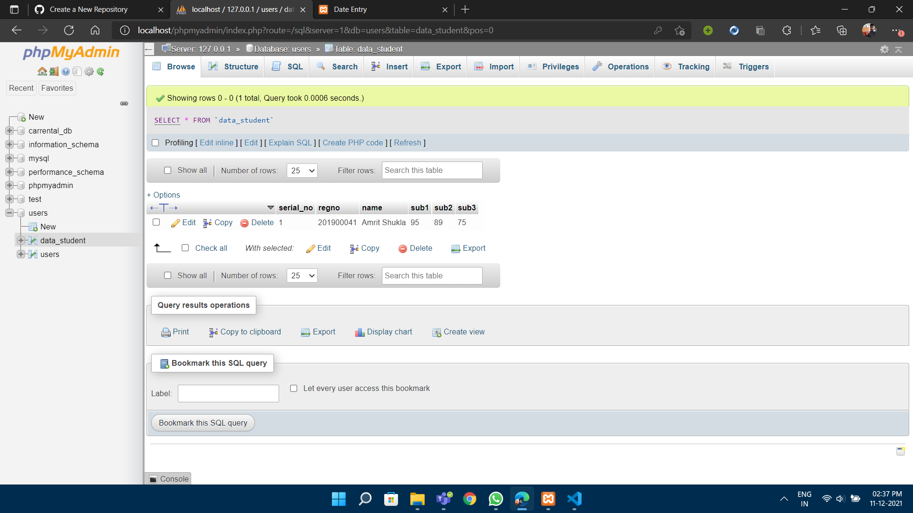

## Data Reterival page

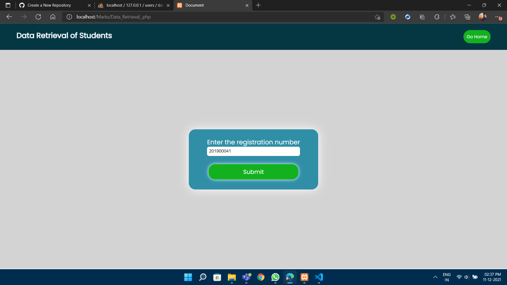

## Data After Reterival

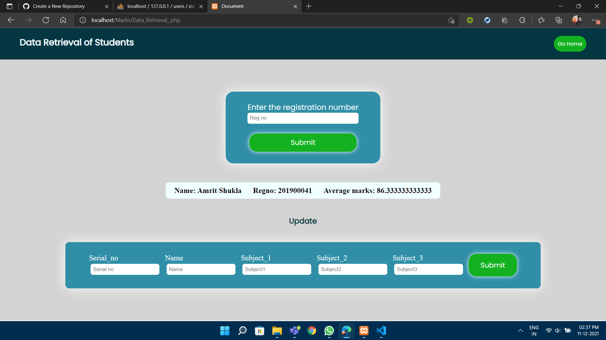

## update page

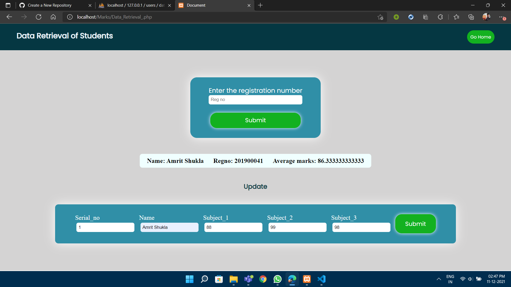

## Data updated in database

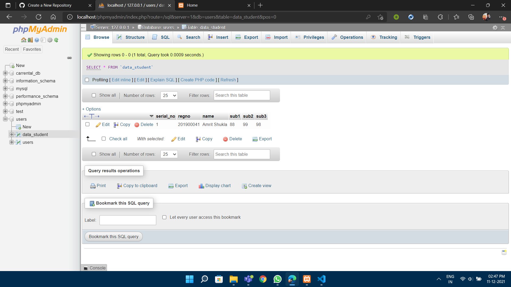

## Click on any favorite player

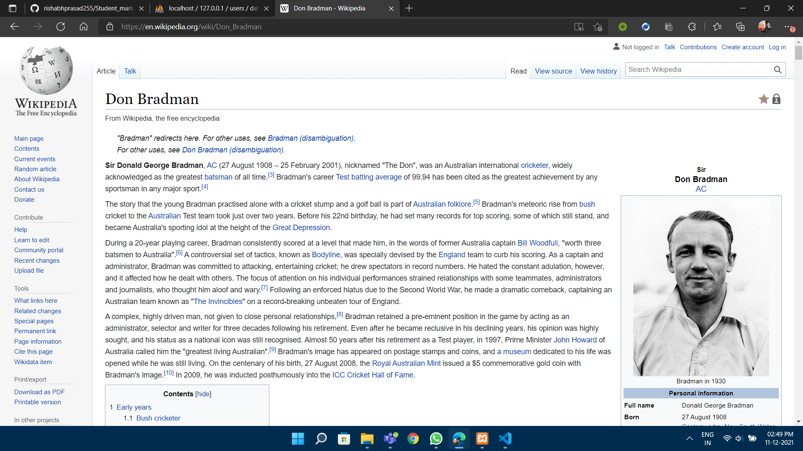

## Click on logout button

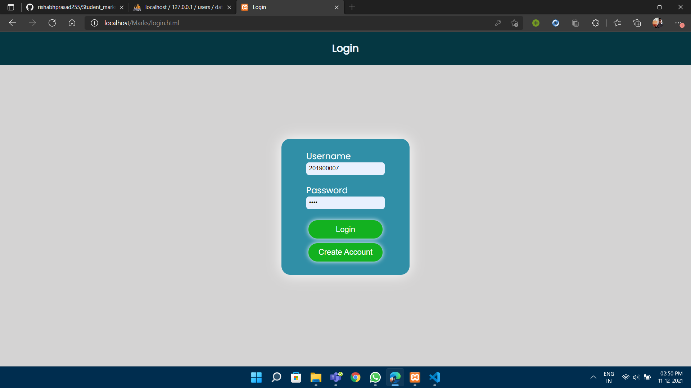